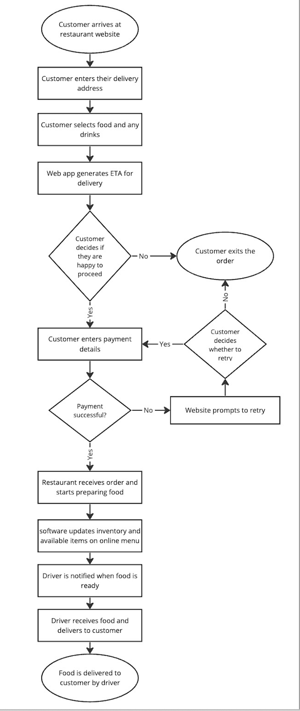

# Theory Questions

## 1.1 What does SDLC stand for?
SDLC stands for Software Development Lifecycle. It is the process used when building software which involves planning, requirements, design, implementation, testing & integration, deployments and maintenance.

## 1.2 What exception is thrown when you divide a number by 0?
ZeroDivisionError: division by zero

## 1.3 What is the git command that moves code from the local repository to the remote repository? 

Git Push is the command you run to move(push) code from the local repository to the remote one.

## 1.4 What does NULL represent in a database? 
In a database, a NULL value means that the specific data field (column in a row) has no value.

## 1.5 Name 2 responsibilities of the Scrum Master 
Scrum is a subset of Agile which is a responsive, incremental way of working. A Scrum Master is someone who acts as a a coach and facilitator to the development team, offering guidance to ensure that they are following scrum best practices.

The Scrum Master is also responsible for guiding the Product Owner so that they are able to effectively manage the Product Backlog.

## 1.6 Name 2 debugging methods, and when you would use them.

Debugging is the processing of analysing, detecting and fixing any errors in code. 
One way to debug code is to use a built in debugging tool such as the debugging tool in a clever IDE like pyCharm. While the application is running,  the debugging mode allows you to stop the application (at a breakpoint), check what values exist within the application, check their validity and opt to continue the program. Using breakpoints in the code allows you to effectively identify if something is going wrong within the application.

Another way to debug is to use the Python library called ‘pdb’, which allows you to run programs in debugging mode. The syntax for importing pdb is:

```
import pdb
pdb.set_trace()
```

The pdb module allows you to catch any errors in the application. You would use this method of debugging if you were using a simple terminal compared to a clever IDE like pyCharm. For example, if you were attempting to deploy an application on a server and a debugging tool was not available.

## 1.7 Looking at the following code:

```
def can_pay(price, cash_given):
   if cash_given >= price:
       return True
   else:
       return False
```

### describe a case where this function would throw an error when called. Describe this case and talk about what exception handling you’ll need. 

This function could throw a ```TypeError: '>=' not supported between instances of 'int' and ‘str' ``` when a string is passed as one of the arguments in the function. For example, I get that TypeError when I run:
```
can_pay(‘8’, 10)
```
That’s because, in the if statement I am trying to compare a string to an integer with the >= operator.
There are a few exception handling approaches I could take here:
The caller of the function needs to try-except the error in order to test the code for errors and handle the error in a way that is appropriate for the caller. For example:

```
try:
   can_pay(‘8’, 10)
except TypeError:
    print(“There has been a TypeError.”)
```
This is a user-friendly way of drawing an attention to an error for the caller.

2. `can_pay` could try-except around the if-else statement and return a default value in the except section. This however would need to be made clear to the caller as the default value behaviour may otherwise be unexpected. An example of this:

```
def can_pay(price, cash_given):
 try:
    if cash_given >= price:
        return True
    else:
        return False
 except TypeError:
    return None
    
# calling the function
can_pay('8', 10)
```

3. Another option is to validate the inputs to can_pay before it is called, to ensure that only integers are passed.

## 1.8 What is git branching? Explain how it is used in Git. 
 
Git branching is a way to effectively make a copy of the original source code (the main or master branch). The git branch allows you to make changes to the branch without affecting main.
In order to create a branch, in the terminal you can run `git branch name` which would create a new branch called `name`. Or you can run `git checkout -b name` which will create a branch called `name` if it doesn’t already exist, and it will switch (checkout) to that branch. 
If you want to merge your `name` branch with your main branch, you can create what is called a pull request via `git pull`. Code on your branch is reviewed and if its ok, then it is merged to the main branch.


## 1.9 Design a restaurant ordering system. 
You do not need to write code, but describe a high-level approach: 
Draw a list of key requirements
What are your main considerations and problems?
What components or tools would you potentially use? 


### Key requirements for a restaurant ordering system would be:
I am assuming that the restaurant ordering system is online and the food is delivered to their home. I also assume the use of automated inventory management updating available menu items.

1. Customer creates an account at the restaurant website
2. Customer enters their delivery address
3. Customer selects food and any drinks
4. The web app generates an ETA for delivery
5. The customer can then decide to proceed with the order or they can exit the order
6. The customer can enter payment details
7. If the payment details are unsuccessful, they can decide whether to retry or exit the order
8. If the payment is successful, the restaurant receives the order and start preparation
9. Software updates the inventory and available items on online menu
10. Driver is notified that food is ready
11. Driver receives food and delivers to the customer

Please see the image below for a visual representation of the above.
 
### Considerations and Problems:
- Customer could receive the wrong order and then has to wait for order to be rectified
- User is unable to make the card payment (due to a problem with the payment provider or another system error)
- Inventory may not be updated correctly and the customer orders an item that is no longer available
- The restaurant can only take orders when it is open, otherwise a customer could be waiting for a very long time!
- Driver may get lost or encounter bad traffic so wait time may exceed ETA
- User may have specific readability concerns: important to make sure site is accessible
- Website needs to be able to handle the load of customers
- Kitchen needs to be able to handle the number of orders


### Tools to use:
- We should use Python to build the web API and Javascript for the web frontend.
- Ordering software could use a inventory management system to automate the updating of menu items.
- Restaurant could use an online kitchen management tool so that the chefs know what meals to prioritise first (depending on order time, eta and amount)
- Restaurant can use a database to store and collect data about the customer such as their preferences in order to make future recommendations more accurate
- To improve delivery accuracy and reduce delivery errors, the Restaurant could use courier software similar to what Uber uses.
- If the delivery ETA has passed and the Restaurant still has not received notification from the driver of a successful delivery, there could be an automated email sent to customers with an update apologising for the delay.